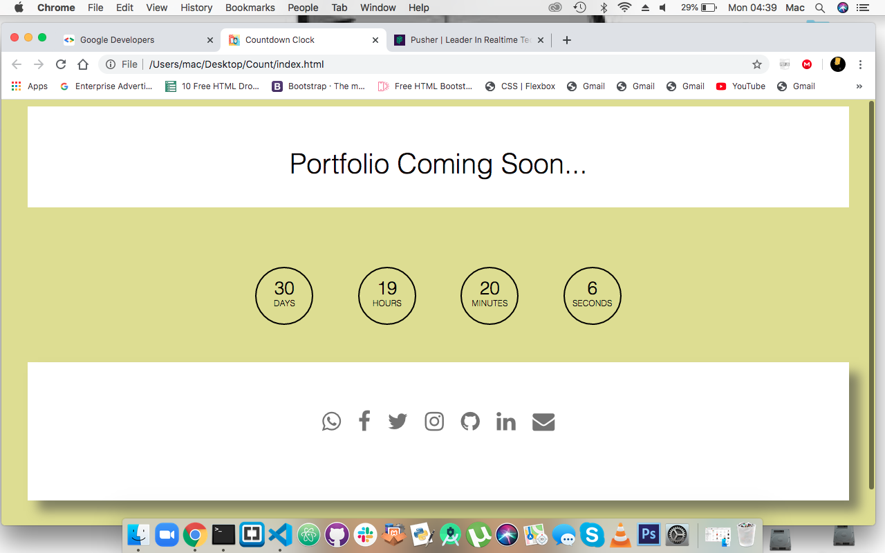

# Countdown Clock

This is a sample responsive timer set to display a countdown clock between the current date 4/05/2020 and set date 4/06/2020. 

## Setup/Getting Started
- Open your terminal.
- Initialize git on your terminal.
- git clone <https://github.com/ngala21/Countdown-Clock.git>.
- open 'Count' folder.
- Run it on a browser preferably Chrome.

## Technologies Used
- HTML
- CSS
- Javascript
- Bootstrap

## Support and contact details

         In case of any issues please do contact ngalamike21@gmail.com
         
## Authors

* **Ngala Mike** - *Initial work* - [ngala21](https://github.com/ngala21)
         
### License

    Copyright (c) 2020 Ngala Mike

